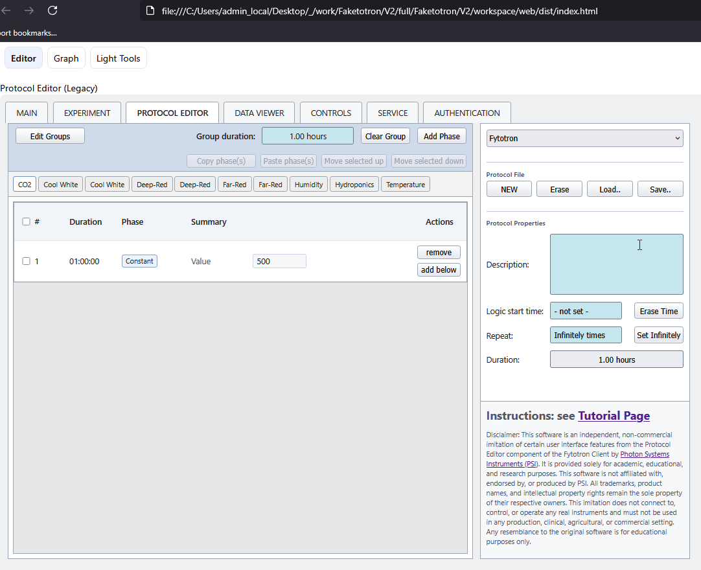
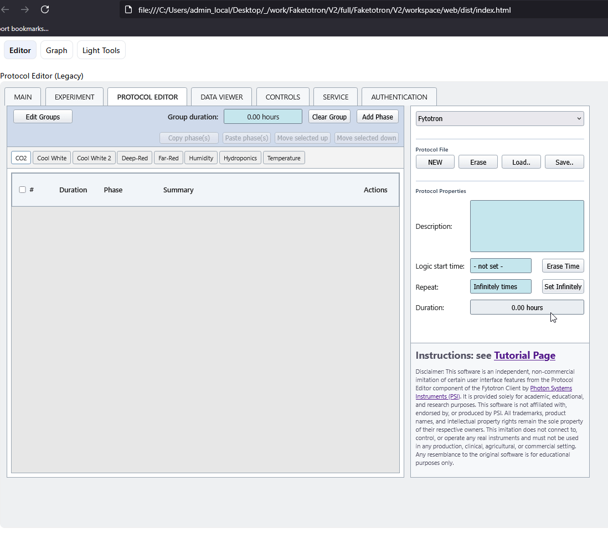
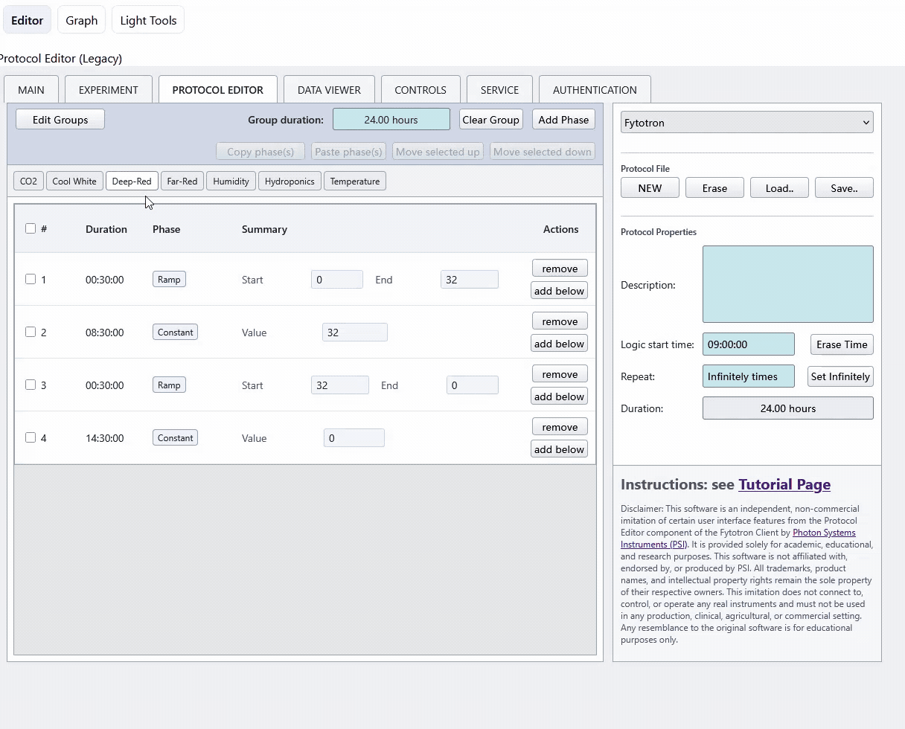
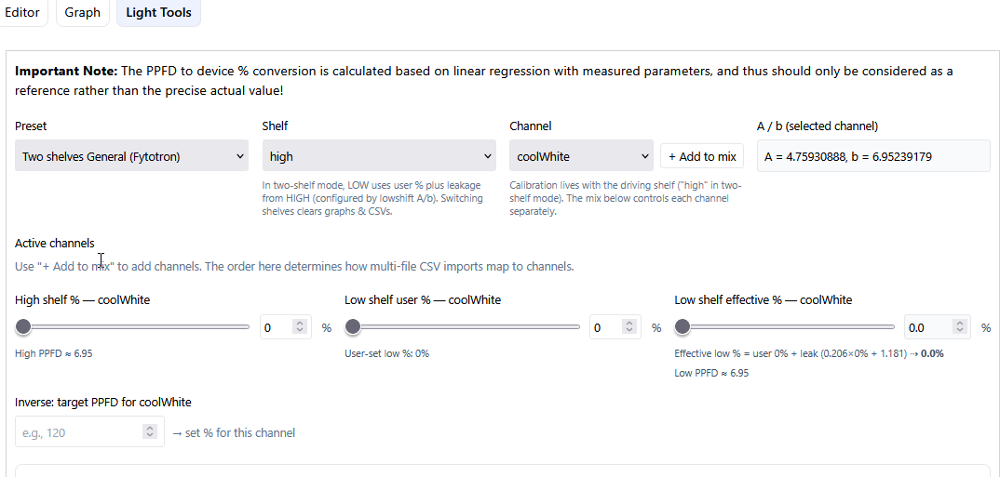
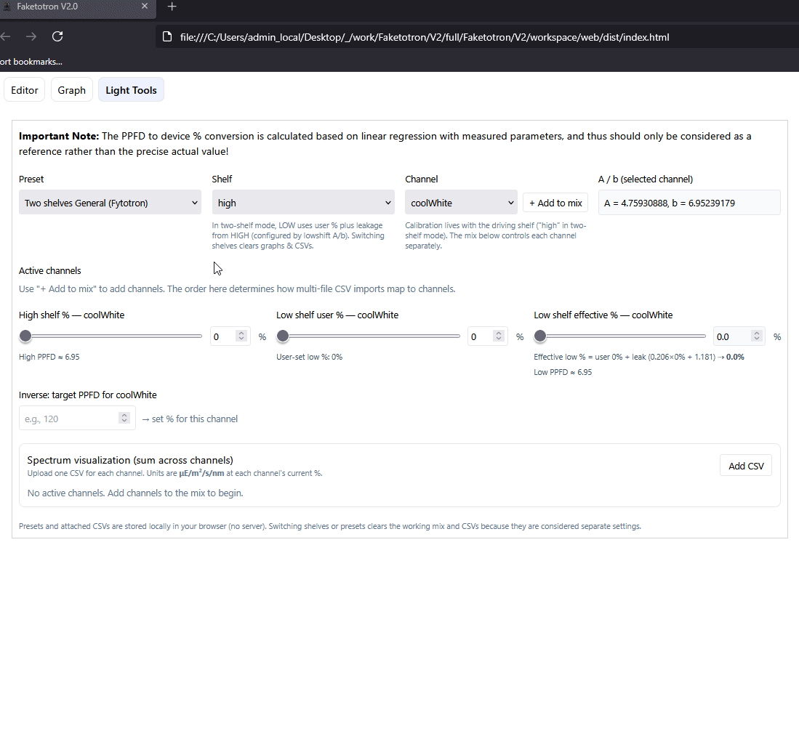
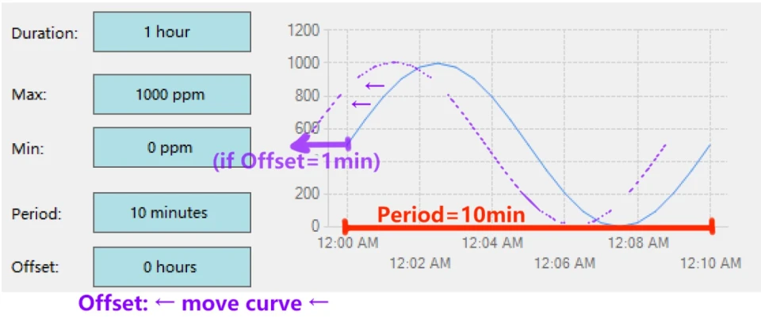
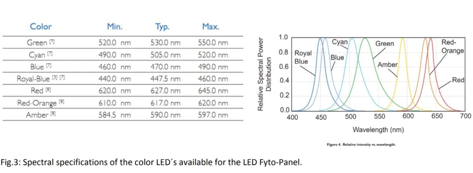
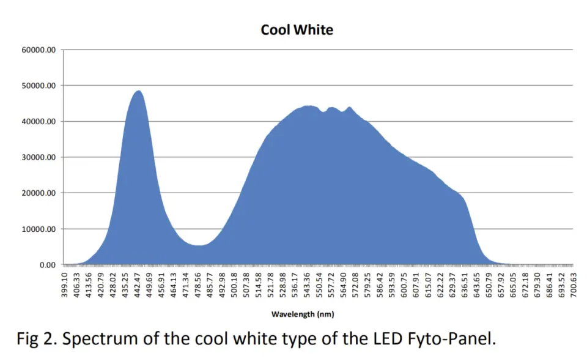
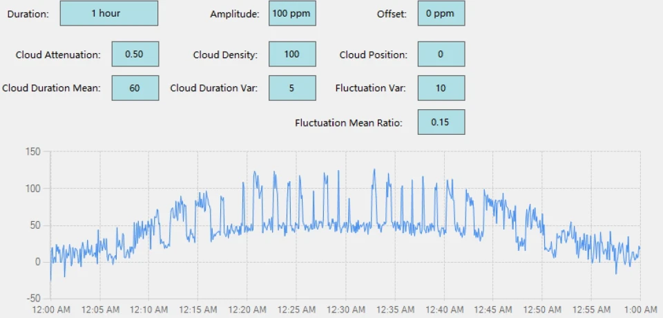

# Faketotron
a mock Fytotron Client protocol editor and viewer.

## Disclaimer

This project is an independent, non-commercial imitation of certain features from the 
Protocol Editor component of the *Fytotron Client* by Photon Systems Instruments (PSI).

It is intended solely for academic, educational, and research purposes.  
It is **not affiliated with, endorsed by, or produced by Photon Systems Instruments**.  
All trademarks, product names, and intellectual property rights remain the sole property of their respective owners.

This software is designed to generate `.fyt` files that are compatible with PSI instruments, 
but it does **not** connect to or control any real instruments and must **not** be used in 
any production, clinical, agricultural, or commercial environment.

### No Endorsement

Neither the name of the author(s), the university, nor the name "Photon Systems Instruments" 
may be used to endorse or promote products derived from this software without specific prior written permission.  
Any resemblance to the original *Fytotron Client* software is for educational simulation purposes only.

## License
This project is licensed under a custom **BSD-3-Clause Academic Use License**.  
This is **not** the standard BSD 3-Clause license — it includes a non-commercial restriction.  
See [LICENSE](LICENSE) for details.

# User Guide (v2)
Faketotron is a mock Fytotron Client's protocol editor. You can use it to customize your experiment protocol before we load it to the PSI instruments, including ME Chambers, Helios and Hades. It's a html based interface that can be opened with any browser.

You can create any customized protocol with the interface, and download the configuration files (a machine readable .fyt file that can be loaded directly into the PSI systems, and a human-readable .json file for debugging). You can also Load .fyt file back to visualize.

 
## Basics

The basic idea is to combine 4 types of phases: **constant, ramp, sine and cloud** to simulate any cycle. For example, we can take 

Constant: 16℃ at night for 7hrs → Ramp: Temperature rising from 16℃ to 21℃ in 30min → Constant: 21℃ at daytime for 16hrs → Ramp: Temperature falling from 21℃ to 16℃ in 30min

as a temperature simulation in a 24-hour day.

<table><colgroup><col><col><col></colgroup><thead><tr><th>
Phase Type
</th><th>
Meaning
</th><th>
Example or Use Case
</th></tr></thead><tbody><tr><td>
<strong>Constant</strong>
</td><td>
Hold a constant value in a Duration.
</td><td>
hold 22 °C for 12 hours
</td></tr><tr><td>
<strong>Ramp ( ⟋ )</strong>
</td><td>
Linearly move from Start to End over a Duration.
</td><td>
raise CO2 from 200 ppm to 400 ppm in half an hour
</td></tr><tr><td>
<strong>Sine ( ∿ )</strong>
</td><td>
Sine curve that oscillate between Min and Max with a Period.
</td><td>
circadian-like periodic changes
</td></tr><tr><td>
<strong>Cloud</strong>
</td><td>
Pseudo-random “cloud cover” behavior.
</td><td>
realistic flicker lighting patterns
</td></tr></tbody></table>

Similarly, we can set the CO2 level (ppm) changes as such, or set up watering schedule.

 
## Quick Start

1. Download the Faketotron html file and open it with your browser.

2. Select the desired Profile (i.e. Chamber type) at top right corner from the scroll-down, then click NEW under Protocol File at right panel. (Note: Hades i.e. Hotel is here only for demonstration. Always contact m.pereiramendes@uu.nl for possibilities first.)

<table><colgroup><col><col><col></colgroup><thead><tr><th>
Faketotron Profile
</th><th>
Applies to
</th><th>
Code in Fytotron Client
</th></tr></thead><tbody><tr><td>
Fytotron (default)
</td><td>
Standard Chambers (PSI 1), Helios (PSI 5)
</td><td>
Chamber S.
</td></tr><tr><td>
Helios Growth
</td><td>
Helios Growth room (PSI 5)
</td><td>
HeliosFyto
</td></tr><tr><td>
Extended Temperature
</td><td>
Extended Temperature Chambers (PSI 2)
</td><td>
Chamber T.
</td></tr><tr><td>
Daylight
</td><td>
Daylight Simulation Chambers (PSI 3)
</td><td>
Chamber D.
</td></tr><tr><td>
Hotel
</td><td>
Hades Growth rooms (PSI 4)
</td><td>
HadesFyto
</td></tr></tbody></table>

3. Create groups and assign variables to groups, or use default settings. Create group only if you need different settings for **_different parts/zones_** of the chamber (e.g. upper shelf vs. lower shelf) for the **_same variable type_**. > For example, if you want different Cool White light intensity for upper and lower shelf, you first need to create another Cool White type of group, then click **Move to** button on the first group to move it to this new group. Click **OK at bottom left corner** to confirm.

You can always edit groups and re-assign variables later, using the button at top left corner. Note that **empty groups will be removed automatically when you click OK.**

4. Click Add Phase to add phases (treatments) for each group. The phases run by the # order. Drag rows to reorder.

5. Logic start time on the right panel means the clock time (e.g. 9:30 AM) of starting the protocol. If not set, the protocol will start at the time device admin press start on the machines (i.e. relative time). **Important note:** If your logic start time mismatches the actual starting time, it **_will not wait until the next cycle._** It will rather start at the progress percentage. For example, if you set up a 24 hour protocol cycle with logic start time at 9AM, but ask the admin to start it at 3PM, the protocol will run directly from its 25% set point.

6. Click Save.. to save (download) both .fyt and .json file. **Before you save, always add a short description!!**

7. Click Load.. to load only .fyt files. Note that you need to change the Profile type on the scroll-down above it to make sure it matches with the .fyt file to load, otherwise it will raise an error.

## Graph Tab
Graph tab provides a visualization of the current protocol and allows you to edit the protocol in a visualized manner.

To edit phases here, click at the starting endpoint circle, then edit the values at the panel. Click Save to Editor after you finish. Note: switching between Editor and Graph can discard the unsave changes. 

**Warning: There's no range limit check in this visual editor.** It is more recommended to edit in the Editor tab. Meanwhile, the tempreature value is shown as temperature * 10 (e.g. Value 210 means 21.0 °C)

## Grouped Actions
You can perform grouped actions (copy-pasting, moving) by selecting multiple phases. Copying multiple phases cross different variable groups (e.g. copy Cool White phases to Deep Red) and even different protocols is also possible. 

Auto range check and wrapping will be done when performing cross-group pasting: For example, if you're trying to copy CO2's 300 (ppm) to Lights' 0-100 (%) range, it will auto wrap it to 100. *Note: temperature is stored as temp×10 for the digit after dot (e.g. 30.2℃ is stored at 302). It's in this way to match the PSI machine. That means copying a 30.2 (℃) to other variable groups will result in value = 302.*

## Light Tools

You can switch to Light Tools tab to calculate the **machine setpoint (%) to standard unit (μE/m²/s/nm)**.

For chambers that has 2 shelves, we calculate the leakge from high to low base on the high shelf settings. 

You can add the measurement files from `/Light Calibrations` to visualize the light curves by each channel. .

## Metadata Tab

Faketotron offer  metadata *Environment* and *Experimental Factor* sheet download for **standard 1-day style protocol**. 

A standard 1-day style protocol is a 24-hour protocol that has time 4 periods: Night (Const, dark and/or low temp), Day adapt (Ramp, moving condition to Day), Day (Const, bright and/or high temp), Night adapt (Ramp, moving to Night). It's of a /‾‾‾‾\\___ shape. Most protocols in Reference Protocols are of this type.

In MIAPPE, 
- **Environment** is defined as what's being kept constant throughout the experiment across all different groups.
- **Experimental Factor** is the controlled variables (and thus will have at least 2 groups, e.g. normal temperature versus cold exposure).

### Usages
- Click **Read current** to automatically parse current protocol from Editor (this will only work if the current protocol contains at least ramp-const-ramp-const structure, and the time period must match if there's multiple).
- Click **Generate protocol** to translate this table into protocol, and load to Editor.

⚠️Be careful that these 2 buttons will overwrite your current metadata table or current protocol in Editor.

For each column (variable group),
- Check **Constant** if the field will not change over time. 
- Check **Exp. Factor** box if you are using this condition as a controlled variable. Adjust the Num of groups based on your experiment design (e.g. 3 if you have 3 temperature groups).

⚠️Note: when generating protocol with Exp. Factor fields, the first value will be used.

After finish, click **Download csv** to get your Environment sheet (and Experimental Factor sheet, if exists.)

## Important Notes:
- **Variable 2 refer to the Higher shelf.** For example, CoolWhite2 or DeepRed2 is for the settings on the higher shelf, while CoolWhite is for the lower shelf.
- **Time format:** HH:MM:SS for no more than 24 hours. **D.HH:MM:SS for over 24 hours.** For example, 01:30:00 for 1.5 hrs, and 1.06:00:00 for 30 hours (**note: use 1.00:00:00 for 24 hrs**)
- Sine phase: It is defined in a not really mathematical way.
  - Don't confuse **Duration** & **Period**. Assume that your Period=10min and Duration=1hour, the value will oscillate for 6 times.
  - Offset is how much you move the curve to the left.
  - For _y(t) = A sin(ωt+φ) + C_: A=(Max-Min)/2, ω=2π/Period, φ=2π*Offset/Period, C=(Max+Min)/2
- **Group & Total Duration: _The best practice is to make all Group durations the same._**
  - For example, even if you don't need Hydroponics treatment in your 24 hour light treatment protocol, it is still recommended to add a constant Hydroponics phase with Duration = 24:00:00 and value = 0.
  - If there's mismatches, there will be a pop-up alert while saving.
  - Check Group duration at top bar for each group and total duration at right panel. Total duration is the longest duration across the groups.
 
## Variable Meanings: LED Spectral Ranges
<table><colgroup><col><col><col></colgroup><thead><tr><th>Name</th><th>Wavelength Range (nm)*</th><th>Common Usage</th></tr></thead><tbody><tr><td><strong>UVA</strong></td><td><strong>315-400**</strong></td><td>Triggers protective pigments (anthocyanins, flavonoids), stress responses, pest deterrence.</td></tr><tr><td><strong>Blue</strong></td><td><strong>460-490</strong></td><td>Regulates stomatal opening, leaf expansion, and chlorophyll synthesis.</td></tr><tr><td><strong>Cyan</strong></td><td><strong>490-520</strong></td><td>Complements blue/red for balanced spectra; aids in chlorophyll absorption and canopy penetration.</td></tr><tr><td><strong>Green</strong></td><td><strong>520-550</strong></td><td>Penetrates deeper into canopy; enhances visual color rendering and leaf morphology studies.</td></tr><tr><td><strong>Amber</strong></td><td><strong>585-597</strong></td><td>Modulates plant photoperiodic responses; can influence flowering and pigment production.</td></tr><tr><td><strong>Red</strong></td><td><strong>620-645</strong></td><td>Drives photosynthesis efficiency and biomass accumulation.</td></tr><tr><td><strong>Deep Red</strong></td><td><strong>650-670</strong></td><td>Maximizes photosynthetic rate; promotes flowering and fruiting.</td></tr><tr><td><strong>Far Red</strong></td><td><strong>720-750</strong></td><td>Alters phytochrome state (Pr/Pfr balance); regulates shade avoidance, seed germination, and flowering timing.</td></tr></tbody></table>

- Wavelength Range from PSI documentation
- No explicit mention of UVA values from PSI. This is a typical range.

### Cool White: Broad spectrum, 4,500 – 10,000 K (CCT)

## What's Extra & What's Missing

- Although PSI is actually storing times in second level precision (hh:mm:ss), you cannot edit it in their own Fytotron Client™ application. You can do it at Faketotron and the machines can still execute the protocols at second level, but if you need to edit it on the machines, the seconds will be dropped.
- Since PSI didn't reveal the formula for Cloud phases, there's no visualization. If you are considering using cloud phase, please contact v.meline@uu.nl for more details.

# Development

For wrapping customized V1 into V2 and editing Light Tool preset, see `\V2\README.md`

For adding or modifying the profiles at legacy editor (V1), you can edit and open directly the `V2\workspace\web\src\legacy\latest\index.html`, and modify the profile default json at `const PROFILE_JSONS` and their corresponding ranges at `const RANGES`. 

The .json (variable groups and names) can be obtained by the real Fytotron Client by saving the protocol (.fyt file) to local computer, then open it using vscode or other hex decoder. For the range limit, you need to test it yourself on the real machine.

**Be very careful to also edit `const MACHINE_VAR`**: It's the actual machine variable name that you should obtain from the "real" .fyt file. We perform some frontend name mapping to match the display name in the real Fytotron (the real Fytotron Client has different display names than their machine variable names).