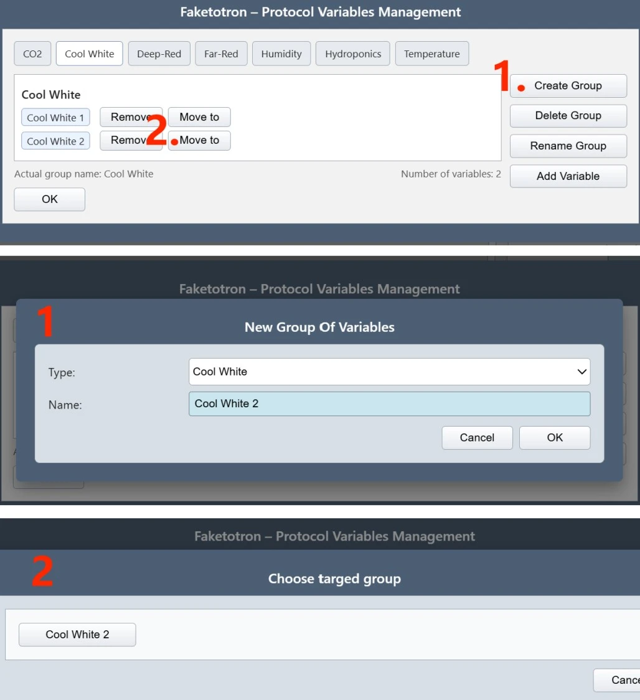
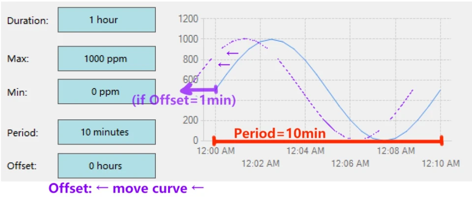
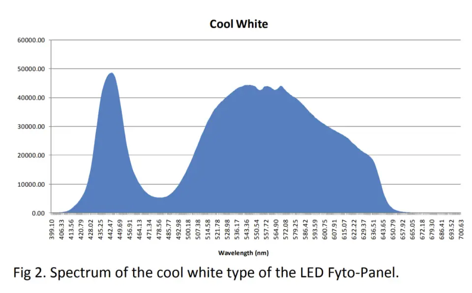
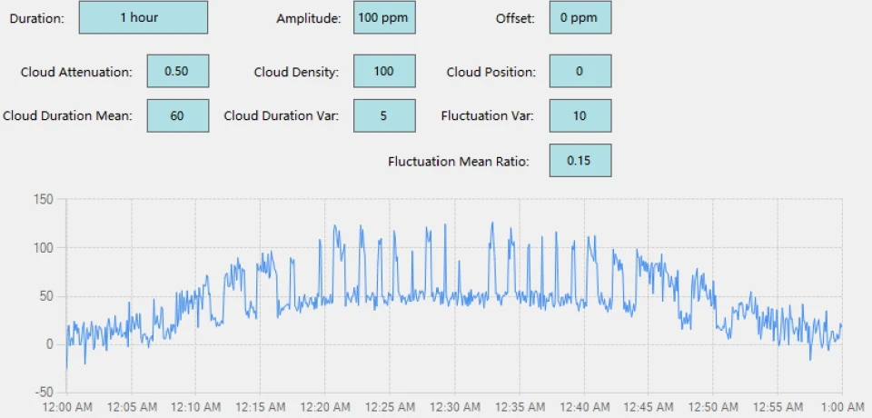

# Faketotron
a mock Fytotron Client protocol editor and viewer.

## Disclaimer

This project is an independent, non-commercial imitation of certain features from the 
Protocol Editor component of the *Fytotron Client* by Photon Systems Instruments (PSI).

It is intended solely for academic, educational, and research purposes.  
It is **not affiliated with, endorsed by, or produced by Photon Systems Instruments**.  
All trademarks, product names, and intellectual property rights remain the sole property of their respective owners.

This software is designed to generate `.fyt` files that are compatible with PSI instruments, 
but it does **not** connect to or control any real instruments and must **not** be used in 
any production, clinical, agricultural, or commercial environment.

### No Endorsement

Neither the name of the author(s), the university, nor the name "Photon Systems Instruments" 
may be used to endorse or promote products derived from this software without specific prior written permission.  
Any resemblance to the original *Fytotron Client* software is for educational simulation purposes only.

## License
This project is licensed under a custom **BSD-3-Clause Academic Use License**.  
This is **not** the standard BSD 3-Clause license — it includes a non-commercial restriction.  
See [LICENSE](LICENSE) for details.

# User Guide (v1.4)
Faketotron is a mock Fytotron Client's protocol editor. You can use it to customize your experiment protocol before we load it to the PSI instruments, including ME Chambers, Helios and Hades. It's a html based interface that can be opened with any browser.

You can create any customized protocol with the interface, and download the configuration files (a machine readable .fyt file that can be loaded directly into the PSI systems, and a human-readable .json file for debugging). You can also Load .fyt file back to visualize.

 
## Basics

The basic idea is to combine 4 types of phases: **constant, ramp, sine and cloud** to simulate any cycle. For example, we can take 

Constant: 16℃ at night for 7hrs → Ramp: Temperature rising from 16℃ to 21℃ in 30min → Constant: 21℃ at daytime for 16hrs → Ramp: Temperature falling from 21℃ to 16℃ in 30min

as a temperature simulation in a 24-hour day.

<table><colgroup><col><col><col></colgroup><thead><tr><th>
Phase Type
</th><th>
Meaning
</th><th>
Example or Use Case
</th></tr></thead><tbody><tr><td>
<strong>Constant</strong>
</td><td>
Hold a constant value in a Duration.
</td><td>
hold 22 °C for 12 hours
</td></tr><tr><td>
<strong>Ramp ( ⟋ )</strong>
</td><td>
Linearly move from Start to End over a Duration.
</td><td>
raise CO2 from 200 ppm to 400 ppm in half an hour
</td></tr><tr><td>
<strong>Sine ( ∿ )</strong>
</td><td>
Sine curve that oscillate between Min and Max with a Period.
</td><td>
circadian-like periodic changes
</td></tr><tr><td>
<strong>Cloud</strong>
</td><td>
Pseudo-random “cloud cover” behavior.
</td><td>
realistic flicker lighting patterns
</td></tr></tbody></table>

Similarly, we can set the CO2 level (ppm) changes as such, or set up watering schedule.

 
## Quick Start

1. Download the Faketotron html file and open it with your browser.

2. Select the desired Profile (i.e. Chamber type) at top right corner from the scroll-down, then click NEW under Protocol File at right panel. (Note: Hades i.e. Hotel is here only for demonstration. Always contact m.pereiramendes@uu.nl for possibilities first.)

<table><colgroup><col><col><col></colgroup><thead><tr><th>
Faketotron Profile
</th><th>
Applies to
</th><th>
Code in Fytotron Client
</th></tr></thead><tbody><tr><td>
Fytotron (default)
</td><td>
Standard Chambers (PSI 1), Helios (PSI 5)
</td><td>
Chamber S., HeliosFyto
</td></tr><tr><td>
Extended Temperature
</td><td>
Extended Temperature Chambers (PSI 2)
</td><td>
Chamber T.
</td></tr><tr><td>
Daylight
</td><td>
Daylight Simulation Chambers (PSI 3)
</td><td>
Chamber D.
</td></tr><tr><td>
Hotel
</td><td>
Hades Growth rooms (PSI 4)
</td><td>
HadesFyto
</td></tr></tbody></table>

3. Create groups and assign variables to groups, or use default settings. Create group only if you need different settings for **_different parts/zones_** of the chamber (e.g. upper shelf vs. lower shelf) for the **_same variable type_**. > For example, if you want different Cool White light intensity for upper and lower shelf, you first need to create another Cool White type of group, then click **Move to** button on the first group to move it to this new group. Click **OK at bottom left corner** to confirm.

You can always edit groups and re-assign variables later, using the button at top left corner. Note that **empty groups will be removed automatically when you click OK.**

4. Click Add Phase to add phases (treatments) for each group. The phases run by the # order. Drag rows to reorder.

5. Logic start time on the right panel means the clock time (e.g. 9:30 AM) of starting the protocol. If not set, the protocol will start at the time device admin press start on the machines (i.e. relative time). **Important note:** If your logic start time mismatches the actual starting time, it **_will not wait until the next cycle._** It will rather start at the progress percentage. For example, if you set up a 24 hour protocol cycle with logic start time at 9AM, but ask the admin to start it at 3PM, the protocol will run directly from its 25% set point.

6. Click Save.. to save (download) both .fyt and .json file. **Before you save, always add a short description!!**

7. Click Load.. to load only .fyt files. Note that you need to change the Profile type on the scroll-down above it to make sure it matches with the .fyt file to load, otherwise it will raise an error.

## Light Intensity Conversion

The conversion from **% to SI (μE/m²/s/nm) is Linear** (with R2 > 0.98). To convert PPFD to percentage, use: 

<b>(PPFD - b) / A</b>

- This function work with larger error at less than 10%, but no larger than 2%.
- **For Cool White, PPFD is calculated between 400-700 nm. For single color channels, PPFD is calculated based on their wavelength.** See Variable Meanings section.
- These parameters are measured at the height of the shelves. If you are adding too much extra height (e.g. using high boxes or pots), the values can be higher than what you need. In this case, please contact us to do an extra measurement.

### Standard & Extended Temperature Chambers

Due to light leakage from higher shelf to lower shelf, the lower shelf has larger PPFD values. Note that this table is measured by setting the same percentage for both shelves (e.g. measure at 20% high and 20% low, the low gets 20%+20%*leakage), which means the values can slightly vary if high and low shelves are set with different values.

<table><colgroup><col><col><col></colgroup><thead><tr><th>High Shelf</th><th>b</th><th>A</th></tr></thead><tbody><tr><td>Cool White</td><td>6.95239179</td><td>4.75930888</td></tr><tr><td>Deep Red</td><td>0.29237353</td><td>0.2068177175</td></tr><tr><td>Far Red</td><td>2.18807104</td><td>0.645981561</td></tr><tr><td><strong>Low Shelf</strong></td><td><strong>b</strong></td><td><strong>A</strong></td></tr><tr><td>Cool White</td><td>10.04182487</td><td>5.0786547</td></tr><tr><td>Deep Red</td><td>0.301973515</td><td>0.214909337</td></tr><tr><td>Far Red</td><td>2.290500342</td><td>0.667271879</td></tr></tbody></table>

### Daylight Chambers

<table><colgroup><col><col><col></colgroup><thead><tr><th>Type</th><th>b</th><th>A</th></tr></thead><tbody><tr><td>Cool White</td><td>18.77992866</td><td>4.57636951</td></tr><tr><td>Blue</td><td>3.15987222</td><td>0.131850676</td></tr><tr><td>Cyan</td><td>1.67421176</td><td>0.106566941</td></tr><tr><td>Green</td><td>1.483437</td><td>0.060262099</td></tr><tr><td>Amber</td><td>0.21777367</td><td>0.041825071</td></tr><tr><td>Red</td><td>-0.25071553</td><td>0.2317047152</td></tr><tr><td>Deep Red</td><td>0.98515142</td><td>0.268161697</td></tr><tr><td>Far Red</td><td>1.37220917</td><td>0.222236239</td></tr><tr><td>UVA</td><td>0.025462488</td><td>0.021131864</td></tr></tbody></table>

### Helios
TBA due to ongoing experiments

## Important Notes:
- **Variable 2 refer to the Higher shelf.** For example, CoolWhite2 or DeepRed2 is for the settings on the higher shelf, while CoolWhite is for the lower shelf.
- **Time format:** HH:MM:SS for no more than 24 hours. **D.HH:MM:SS for over 24 hours.** For example, 01:30:00 for 1.5 hrs, and 1.06:00:00 for 30 hours (**note: use 1.00:00:00 for 24 hrs**)
- Sine phase: It is defined in a not really mathematical way.
  - Don't confuse **Duration** & **Period**. Assume that your Period=10min and Duration=1hour, the value will oscillate for 6 times.
  - Offset is how much you move the curve to the left.
  - For _y(t) = A sin(ωt+φ) + C_: A=(Max-Min)/2, ω=2π/Period, φ=2π*Offset/Period, C=(Max+Min)/2
- **Group & Total Duration: _The best practice is to make all Group durations the same._**
  - For example, even if you don't need Hydroponics treatment in your 24 hour light treatment protocol, it is still recommended to add a constant Hydroponics phase with Duration = 24:00:00 and value = 0.
  - If there's mismatches, there will be a pop-up alert while saving.
  - Check Group duration at top bar for each group and total duration at right panel. Total duration is the longest duration across the groups.
 
## Variable Meanings: LED Spectral Ranges
<table><colgroup><col><col><col></colgroup><thead><tr><th>Name</th><th>Wavelength Range (nm)*</th><th>Common Usage</th></tr></thead><tbody><tr><td><strong>UVA</strong></td><td><strong>315-400**</strong></td><td>Triggers protective pigments (anthocyanins, flavonoids), stress responses, pest deterrence.</td></tr><tr><td><strong>Blue</strong></td><td><strong>460-490</strong></td><td>Regulates stomatal opening, leaf expansion, and chlorophyll synthesis.</td></tr><tr><td><strong>Cyan</strong></td><td><strong>490-520</strong></td><td>Complements blue/red for balanced spectra; aids in chlorophyll absorption and canopy penetration.</td></tr><tr><td><strong>Green</strong></td><td><strong>520-550</strong></td><td>Penetrates deeper into canopy; enhances visual color rendering and leaf morphology studies.</td></tr><tr><td><strong>Amber</strong></td><td><strong>585-597</strong></td><td>Modulates plant photoperiodic responses; can influence flowering and pigment production.</td></tr><tr><td><strong>Red</strong></td><td><strong>620-645</strong></td><td>Drives photosynthesis efficiency and biomass accumulation.</td></tr><tr><td><strong>Deep Red</strong></td><td><strong>650-670</strong></td><td>Maximizes photosynthetic rate; promotes flowering and fruiting.</td></tr><tr><td><strong>Far Red</strong></td><td><strong>720-750</strong></td><td>Alters phytochrome state (Pr/Pfr balance); regulates shade avoidance, seed germination, and flowering timing.</td></tr></tbody></table>

- Wavelength Range from PSI documentation
- No explicit mention of UVA values from PSI. This is a typical range.

### Cool White: Broad spectrum, 4,500 – 10,000 K (CCT)

## What's Extra & What's Missing

- Although PSI is actually storing times in second level precision (hh:mm:ss), you cannot edit it in their own Fytotron Client™ application. You can do it at Faketotron and the machines can still execute the protocols at second level, but if you need to edit it on the machines, the seconds will be dropped.
- Since PSI didn't reveal the formula for Cloud phases, there's no visualization. If you are considering using cloud phase, please contact v.meline@uu.nl for more details.

