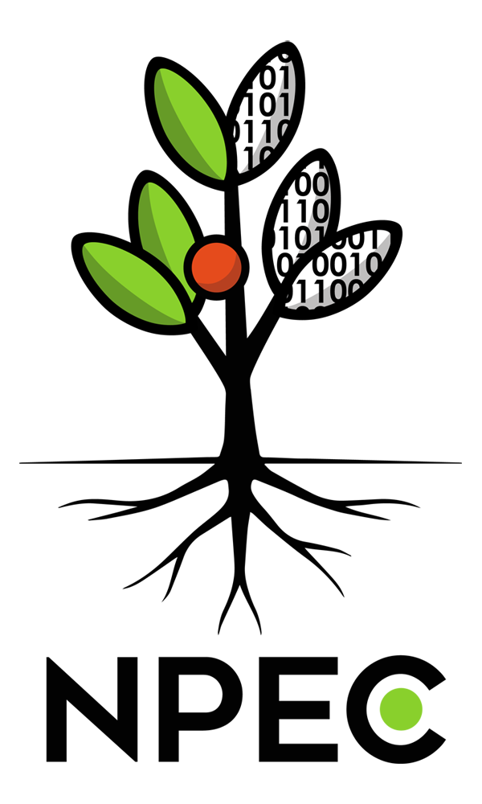

# V2 Dev notes

## Wrapping customized V1 into V2

V1 is inline embedded in V2. To replace V1 to your own version/build, you need to:

1. Put your V1 html file under `\workspace\web\src\legacy\latest`, rename it as `index.html`
2. Copy the [bridge script](#bridge-script) in your html if it doesn't contain this line. You can add it between `</script>` and `</body>` (the third last line).
3. At `\workspace`, run: `pnpm i`, `pnpm -C faketotron-v2-core build`, then `pnpm -C web dev` (requires Node.js and pnpm). You should then see it running at localhost.

If you want to export the app into a single .html, run `pnpm -C web add -D vite-plugin-singlefile` and `pnpm -C web build`, then the single file html should be `\workspace\web\dist\index.html`.

## Editing Light Tool Presets
At `\workspace\web\src\ui\LightTools.tsx`, edit the json profile at `const DEFAULT_PRESETS`.

## bridge script

```js
<script>
/* ====== Protocol receiver from graph tab ====== */
(function () {
  function setProtocolFromHost(proto) {
    try {
      protocol = {
        description: proto?.description || "",
        repeat: proto?.repeat ?? 2147483647,
        logic: proto?.logic || "",
        sections: Array.isArray(proto?.sections) ? proto.sections : [{ parts: [] }],
      };
      document.getElementById("desc").value   = protocol.description;
      document.getElementById("logic").value  = protocol.logic && protocol.logic !== "" ? protocol.logic : "- not set -";
      document.getElementById("repeat").value = protocol.repeat === 2147483647 ? "Infinitely times" : String(protocol.repeat);
      const rebuilt    = buildGroupsFromLoaded(protocol);
      groups           = rebuilt.groups;
      unassigned       = rebuilt.unassigned;
      activeGroupId    = groups[0]?.id || null;
      vmSelectedGroupId= activeGroupId;

      refreshUI();

      parent.postMessage({ type: "legacy:protocol-updated", protocol }, "*");
      console.log("[legacy-bridge] setProtocolFromHost → applied & refreshed");
    } catch (e) {
      console.error("[legacy-bridge] setProtocolFromHost failed", e);
    }
  }

  window.setProtocolFromHost = setProtocolFromHost;

  window.addEventListener("message", (ev) => {
    const msg = ev.data || {};
    if (msg.type === "host:set-protocol") {
      console.log("[legacy-bridge] host:set-protocol");
      setProtocolFromHost(msg.protocol);
    }
  });
})();
</script>
```