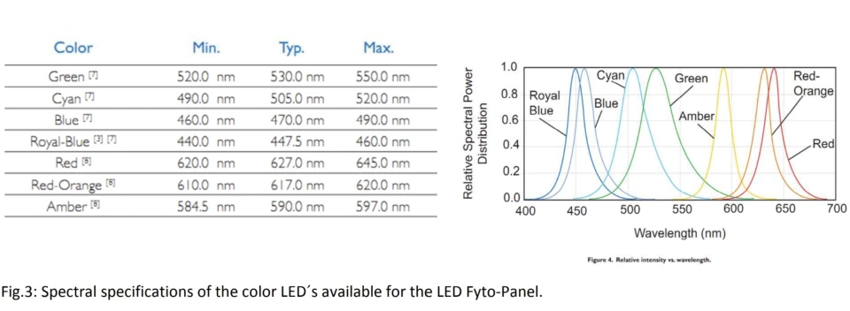
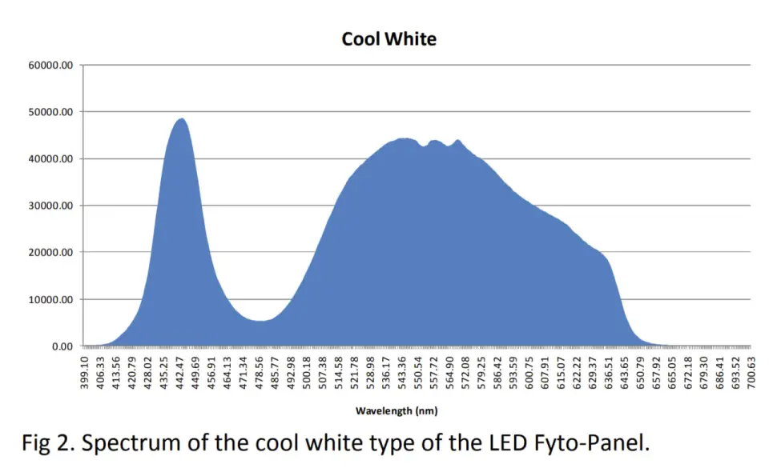

# LED spectral ranges (reference)

This document records the approximate internal spectral mapping used by PSI channels. It is provided as a **reproducibility hint** and to support ontology mapping and interpretation of multi-channel lighting programs.

> Note: These ranges describe channel intent/nominal bands, not a full measured spectral power distribution. For quantitative interpretation, use calibration artifacts described in `Semantics.md`.

<table><colgroup><col><col><col></colgroup><thead><tr><th>Name</th><th>Wavelength Range (nm)*</th><th>Common Usage</th></tr></thead><tbody><tr><td><strong>UVA</strong></td><td><strong>315-400**</strong></td><td>Triggers protective pigments (anthocyanins, flavonoids), stress responses, pest deterrence.</td></tr><tr><td><strong>Blue</strong></td><td><strong>460-490</strong></td><td>Regulates stomatal opening, leaf expansion, and chlorophyll synthesis.</td></tr><tr><td><strong>Cyan</strong></td><td><strong>490-520</strong></td><td>Complements blue/red for balanced spectra; aids in chlorophyll absorption and canopy penetration.</td></tr><tr><td><strong>Green</strong></td><td><strong>520-550</strong></td><td>Penetrates deeper into canopy; enhances visual color rendering and leaf morphology studies.</td></tr><tr><td><strong>Amber</strong></td><td><strong>585-597</strong></td><td>Modulates plant photoperiodic responses; can influence flowering and pigment production.</td></tr><tr><td><strong>Red</strong></td><td><strong>620-645</strong></td><td>Drives photosynthesis efficiency and biomass accumulation.</td></tr><tr><td><strong>Deep Red</strong></td><td><strong>650-670</strong></td><td>Maximizes photosynthetic rate; promotes flowering and fruiting.</td></tr><tr><td><strong>Far Red</strong></td><td><strong>720-750</strong></td><td>Alters phytochrome state (Pr/Pfr balance); regulates shade avoidance, seed germination, and flowering timing.</td></tr></tbody></table>

- Wavelength Range from PSI documentation
- No explicit mention of UVA values from PSI. This is a typical range.

### Cool White: Broad spectrum, 4,500 – 10,000 K (CCT)

